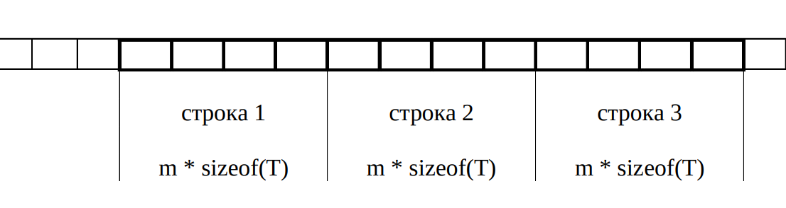
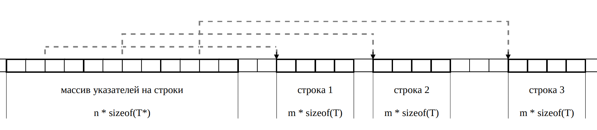
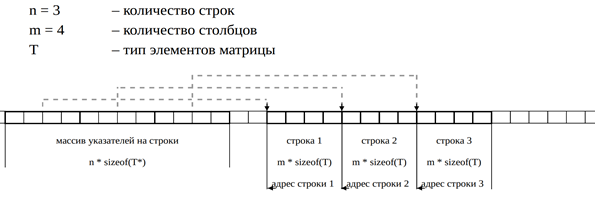
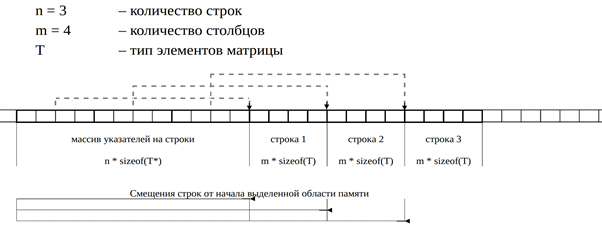

<style>    
    code {
        background-color: #f0f0f0;
        font-family: Consolas, Monaco, 'Courier New', Courier, monospace;
        color:rgb(0, 27, 204) !important;
    }
</style>

# Как пользоваться подготовкой
Все пункты, которые описаны в вопросе, надо прописать в билете. То, что именно написать, взято со слов Ломовского И.В. на консультациях. Желаем успехов в подготовке! 

# 1 - Указатель на void. Стандартные функции обработки областей памяти

### Для чего используется указатель на void, примеры.

Тип указатель void (обобщенный указатель, англ.
generic pointer) используется, если тип объекта
неизвестен:

- полезен для ссылки на произвольный участок
памяти, независимо от размещенных там
объектов;

```c
void *a;
int num = 52;
a = &num;
printf("%d", *(int*)a);
```

- позволяет передавать в функцию указатель на
объект любого типа.

```c
void print(void *ptr, char type) 
{
    if (type == 'i') 
        printf("%d\n", *(int*)ptr);
    if (type == 'f') 
        printf("%.2f\n", *(float*)ptr);
}
```

### Особенности использования + примеры

**Указатель типа void нельзя разыменовывать.**

```c
void *a;
int num = 52;
a = &num;
printf("%d", *a); // ПИСЮН - логично так как не понятно к какому типу мы приведём переменную
```

**К указателям типа void не применима адресная арифметика**

```c
void *a;  
int vodstok_data[6] = {1969, 1979, 1989, 1994, 1999, 2009};
a = vodstok_data; 
a++; // ПИСЮН - логично так как не понятно на сколько ячеек памяти мы должны двинуться (size же разный)
```

### memcpy

`memcpy` копирует данные побайтово

**Сигнатура**

```c
void *memcpy(void *dest, const void *src, size_t count);
```

- dest — указатель на область памяти, куда будут скопированы данные.
- src — указатель на область памяти, откуда будут скопированы данные.
- count — количество байт для копирования.

Если области памяти `src` и `dest` перекрываются, поведение memcpy не определено

**Пример**

```c
int src[5] = {1, 2, 3, 4, 5};
int dest[5];

// Копируем 5 элементов (по размеру int) из src в dest
memcpy(dest, src, 5 * sizeof(int));
```

### memset

`memset` заполняет блок памяти указанным значением.

**Сигнатура**

```c
int memcmp(const void *s1, const void *s2, size_t n);  
```

- s1 и s2 — указатели на блоки памяти для сравнения.    
- n — количество байт для сравнения.  

Полезен для работы с сырыми данными.    

### memmove

**Сигнатура**

```c
void *memmove(void *destptr, const void *srcptr, size_t num);
```

Переместить блок памяти. Функция копирует `num` байтов из блока памяти источника, на который ссылается указатель `srcptr`, в блок памяти назначения, на который указывает указатель `destptr`. Копирование происходит через промежуточный буфер, что, в свою очередь, не позволяет `destptr` и `srcptr` пересекаться.

**Пример**

```c
int src[5] = {1, 2, 3, 4, 5};
int dest[5];

// Копируем 5 элементов (по размеру int) из src в dest
memmove(dest, src, 5 * sizeof(int));
```

# 2 - Функции динамического выделения памяти

## Особенности malloc, calloc, realloc

Библиотека `#include <stdlib.h>`

- Указанные функции не создают переменную, они
лишь выделяют область памяти. В качестве
результата функции возвращают адрес
расположения этой области в памяти компьютера,
т.е. указатель.

- Поскольку ни одна из этих функций не знает
данные какого типа будут располагаться в
выделенном блоке все они возвращают указатель
на void.

- В случае если запрашиваемый блок памяти
выделить не удалось, любая из этих функций
вернет значение NULL.

- После использования блока памяти он должен
быть освобожден. Сделать это можно с помощью
функции free.

### malloc

**Сигнатура**

```c
void* malloc(size_t size);
```

- Функция malloc (C99 7.20.3.3) выделяет блок
памяти указанного размера size. Величина size
указывается в байтах. 

- Выделенный блок памяти не инициализируется
(т.е. содержит «мусор»).

**Пример**

```c
void *a = malloc(sizeof(int) * 3);

```

**malloc и явное приведение типа**

```c
a = (int*) malloc(n * sizeof(int));
```

*Преимущества явного приведения типа:*
- компиляции с помощью c++ компилятора;
- у функции `malloc` до стандарта `ANSI C` был другой прототип `(char* malloc(size_t size))`
- дополнительная «проверка» аргументов разработчиком.

*Недостатки явного приведения типа:*
- начиная с `ANSI C` приведение не нужно
- может скрыть ошибку, если забыли подключить `stdlib.h`
- в случае изменения типа указателя придется менять и тип в приведении.

**Примеч. редактора:**  
Короче щас это не нужно, это нужно было только до стандарта `ANSI C` из за другой сигнатуры функции `malloc`  
Нужно только если мы хотим делать какие либо шуры муры с c++

### calloc

**Сигнатура**

```c
void* calloc(size_t nmemb, size_t size);
```

- Функция calloc (C99 7.20.3.1) выделяет блок
памяти для массива из nmemb элементов, каждый
из которых имеет размер size байт.

- Выделенная область памяти инициализируется
таким образом, чтобы каждый бит имел значение 0. 
(и дальше уже будет преобразование в зависимости от типа, то есть если будет массив char-ов, то он будет заполнен символами `'\0'`) 

**Пример**

```c
a = calloc(n, sizeof(int));
```

### realloc

Перевыделение памяти

```c
void *realloc(void *ptr, size_t size); 
```

- `ptr == NULL && size != 0` Выделение памяти (как `malloc`)
- `ptr != NULL && size == 0` Освобождение памяти (как `free`).
- `ptr != NULL && size != 0` Перевыделение памяти

Перевыделение памяти (в худшем случае)

- выделить новую область
- скопировать данные из старой области в новую
- освободить старую область

Если мы хотим оставить первые n байт из m уже выделенных байт, где m >= n, то с большой вероятностью realloc воспользуется уже выделенной памятью и отработает сильно быстрее, чем malloc + memset + free

Возвращает указатель на новую ячейку памяти

Если выделение не удалось возвращает `NULL`

При использовании обязательно нужно сделать вспомогательный указатель, 
в который передать возвращаемое значение realloc
и в случае если значение не `NULL` присвоить указатель

```c
void *ptmp = realloc(pbuf, 2 * n);
if (ptmp)
    pbuf = ptmp;
else
    // обработка ошибочной ситуации
```

## Что будет, если запросить 0 байт?

Зависит от реализации (implementation-defined C99 7.20.3)

- вернется нулевой указатель;
- вернется «нормальный» указатель, но его нельзя использоваться для разыменования.

Короче или `NULL` или норм указатель но с которым ничего нельзя сделать

### free

```c
void free(void *ptr);
```
Функция free (C99 7.20.3.2) освобождает (делает возможным повторное использование) ранее выделенный блок памяти, на который указывает ptr. 
- Если значением ptr является нулевой указатель, ничего не происходит.  
- Если указатель ptr указывает на блок памяти, который не был получен с помощью одной из функций malloc, calloc или realloc, поведение функции free не определено. 
- Если попытаться освободить дважды указатель выделенные одной из функций выделения памяти, то `UB`

# 3 - Выделение памяти под динамический массив. Типичные ошибки при работе динамической памяти.

Выделение памяти под динамический массив делается с помощью `malloc` / `calloc` / `realloc`:
```c
int *elems = malloc(n * sizeof(int));
```

## 2 способа возврата динамического массива из функции. Реализовать функции.

- Как возвращаемое значение
```c
int *create_array(FILE *f, size_t *n);
```
- Как параметр функции
```c
int create_array(FILE *f, int **arr, size_t *n);
```

## О типичных ошибках при работе с динамической памятью. 

- Неверный расчет количества выделяемой памяти.
- Отсутствие проверки успешности выделения памяти
- Утечки памяти
- Логические ошибки

**Логические ошибки**
- Wild (англ., дикий) pointer: использование непроинициализированного указателя.
- Dangling (англ., висящий) pointer: использование указателя сразу после освобождения памяти.
- Изменение указателя, который вернула функция выделения памяти 
- Двойное освобождение памяти.
- Освобождение невыделенной или нединамической памяти.
- Выход за границы динамического массива. 

## Подходы к обработке ситуации, когда функции динамической памяти вернули NULL.

- Возвращение ошибки (англ., return failure) 
    - Подход, который используем мы 
- Ошибка сегментации (англ., segfault) 
    - Обратная сторона - проблемы с безопасностью 
- Аварийное завершение (англ., abort) 
    - Идея принадлежит Кернигану и Ритчи (xmalloc) 
- Восстановление (англ., recovery) 
    - xmalloc из git 

# 4 - Указатели на функции. Функция qsort

## Для чего в Си используются указатели на функции + примеры

- функции обратного вызова (англ., callback);
- таблицы переходов (англ., jump table);
- динамическое связывание (англ., binding).

Callback (англ, функция обратного вызова) -
передача исполняемого кода в качестве одного из
параметров другого кода. 

**Пример**

`qsort`

---
Jump table (или таблица переходов) — это структура данных, которая используется для быстрого перехода между различными точками в программе.

**Пример**
```c
void func1() {
    printf("Function 1\n");
}

void func2() {
    printf("Function 2\n");
}

int main() {
    void (*jumpTable[3])() = {func1, func2};  // Jump table

    int choice;
    printf("Enter a number (0-1): ");
    scanf("%d", &choice);

    if (choice >= 0 && choice < 2) {
        jumpTable[choice]();  // Вызов функции по индексу
    } else {
        printf("Invalid choice\n");
    }

    return 0;
}
```

Binding - это процесс связывания имен (или переменных) с объектами, функциями или значениями

## Как описывается, инициализируется указатель на функцию

**Общее описание**

```c
return_type (*pointer_name)(parameter_types);
```

**Инициализация**

```c
int add(int a, int b) 
{
    return a + b;
}

int (*func_ptr)(int, int) = add; // Инициализация указателя адресом функции
```

## Как с его помощью вызывается сама функция. 

Как та же функция только с другим именем

## Про qsort, примеры использования.

```c
void qsort(void *base, size_t nmemb, size_t size, int (*comparator)(const void*, const void*));
```

Для функции `qsort` небоходимо разработать свой comparator (очевидно который соответствует сигнатруре приведённой в функции)

Пример:
```c
int compare_int_1(const void *l, const void *r)
{
    int *ll = (int *)l;
    int *rr = (int *)r;
    return *ll - *rr;
} // сравнивает инты как обычно

int compare_int_2(const void *l, const void *r)
{
    int *ll = (int *)l;
    int *rr = (int *)r;
    return (*ll * *ll) - (*rr * *rr);
} // сравнивает инты по модулю
```

`qsort` может обрабатывать любой тип данных так как мы передаём размер одной ячейки нашего массива и функцию для сравнения этих чисел. Смена происходит побайтово
```c
void swap(void *l, void *r, size_t size)
{
    char c;
    char *ll = (char *)l;
    char *rr = (char *)r;
    for (size_t i = 0; i < size; i++, ll++, rr++)
    {
        c = *ll;
        *ll = *rr;
        *rr = c;
    }
}
```

comparator ОБЯЗАТЕЛЬНО ДОЛЖЕН ВОЗВРАЩАТЬ
- ЧИСЛО 0 ПРИ РАВЕНСТВЕ ЧИСЛО 
- БОЛЬШЕ 0 ЕСЛИ ПЕРВОЕ ЗНАЧЕНИЕ БОЛЬШЕ (НУ ИЛИ МЕНЬШЕ ЕСЛИ ВЫ ХОТИТЕ СОРТИРОВАТЬ ПО УБЫВАНИЯ) 
- МЕНЬШЕ НУЛЯ ЕСЛИ ПЕРВОЕ МЕНЬШЕ (НУ ИЛИ БОЛЬШЕ ЕСЛИ ВЫ ХОТИТЕ СОРТИРОВАТЬ ПО УБЫВАНИЯ) 

## Особенности использования указател на функцию (про адресную арифметику). 

Операция `&` для функции возвращает указатель на
функцию, но из-за 6.7.5.3 #8 это лишняя операция. То, что это лишняя операция в С99 не означает, что в других стандартах она лишняя.

```c
int (*p2)(int, int) = &add;
```

Операция `*` для указателя на функцию возвращает
саму функцию, которая неявно преобразуется в
указатель на функцию.

```c
int (*p3)(int, int) = *add;
int (*p4)(int, int) = *****add;
```

Указатель на функцию может быть типом возвращаемого значения функции

```c
#include <stdio.h>

// Функции
int add(int a, int b) { return a + b; }
int multiply(int a, int b) { return a * b; }

// Функция, возвращающая указатель на функцию
//  то что передалось в саму изнчальную функцию и её название 
//                     |          
// то соответтсвует   |  сигнатуре возращаемой функции
// |                  |          |    |
// v                 v          v    v
int (*get_operation(char op))(int, int) 
{
    return (op == '+') ? add : multiply;
}

int main() 
{
    // Получаем указатель на функцию add
    int (*operation)(int, int) = get_operation('+');
    
    // Вызов функции через указатель
    printf("%d\n", operation(3, 4)); // Вывод: 7

    // Получаем указатель на функцию multiply
    operation = get_operation('*');
    
    // Вызов функции через указатель
    printf("%d\n", operation(3, 4)); // Вывод: 12

    return 0;
}
```

## Про указатели на функцию и указатели на void

#### Функция - не объект в терминологии стандарта.

Указатель на функцию одного типа может быть преобразован в
указатель на функцию другого типа и обратно;
результат должен быть равен исходному указателю. Если
преобразованный указатель используется для вызова функции, тип
которой несовместим с указанным типом, поведение
не определено.

Указатели на функцию можно сравнивать.

Согласно C99 6.3.2.3 #1 и C99 6.3.2.3 #8, указатель
на функцию не может быть преобразован к
указателю на void и наоборот.

Но POSIX требует, чтобы такое преобразование
было возможно при работе с динамическими
библиотеками.

# 5 - Утилита make. Назначение, простой сценарий сборки

#### Утилита make
Автоматизирует процесс преобразования файлов из одной формы в другую.  
Разновидности:
- GNU Make (наша радость)
- BSD Make
- Microsoft Make

Для утилиты `make` входным данным является `makefile` - текстовый файл определенного формата, описывающий
- отношения между файлами программы
- команды для обновления каждого файла

Также `make` использует время последнего изменения файла чтобы решить, какие файлы надо обновить

#### Простой сценарий сборки:
```makefile
app.exe: main.o list.o 
    gcc -std=c99 -Wall -Werror -Wpedantic -Wextra -o app.exe main.o list.o

main.o: main.c list.h
    gcc -std=c99 -Wall -Werror -Wpedantic -Wextra -c main.c

list.o: list.c list.h
    gcc -std=c99 -Wall -Werror -Wpedantic -Wextra -c main.c

clean:
    rm *.o *.exe
```
Как работает данный `makefile`:  
Пока что в программе находятся только исходники. По запуску утилиты
```bash
make
```
она по умолчанию выполняет первую цель (`app.exe`). Видит зависимости, которые должны присутствовать в проекте, но их пока что нет, поэтому идет по очереди их выполнять.  
Для зависимости `main.o` есть все необходимое (`main.c`, `list.h`), поэтому сначала выполнится команда цели `main.o`.  
После этого выполнится `list.o`, затем `app.exe`.

Допустим, мы поменяли файл `list.c` и собираем программу. Программа make проверит, что цели содержат актуальные файлы. Для цели `main.o` все так, для `list.o` нет, так как `list.c` был изменен позже, чем имеющийся `list.o` -> он не актуальный и нужно его обновить. После обновления все объектники актуальные и тогда соберется `app.exe`.

#### Ключи утилиты
Указание конкретного мейкфайла
```makefile
make -f makefile_2
```
Безусловное выполнение правил
```makefile
make -B
```
Вывод команд без их выполнения
```makefile
make -n
```
Игнорирование ошибок при выполнении команд
```makefile
make -i
```
# 6 - Утилита make. Назначение, переменные, шаблонные правила

### Важно: упомяните алгоритм работы мейкфайла (см. вопрос 5): если все обновлено, если что-то не обновлено и тд.

#### Утилита make
Автоматизирует процесс преобразования файлов из одной формы в другую.  
Разновидности:
- GNU Make (наша радость)
- BSD Make
- Microsoft Make

Для утилиты `make` входным данным является `makefile` - текстовый файл определенного формата, описывающий
- отношения между файлами программы
- команды для обновления каждого файла

Также `make` использует время последнего изменения файла чтобы решить, какие файлы надо обновить

#### Переменные в make
Бывают явные, неявные, автоматические.

Явные:
```makefile
CFLAGS := -std=c99 -Wall -Werror
```

Неявные:
```makefile
CFLAGS := -std=c99 -Wall -Werror
app.exe: main.c
    $(CC) $(CFLAGS) -o app.exe main.c
```
Неявная потому что она преднаписана уже в самой утилите. `$(CC)` будет равно `cc`.

Автоматические:
- `$^` - список зависимостей
- `$@` - имя цели
- `$<` - первая зависимость

Было:
```makefile
CFLAGS := -std=c99 -Wall -Werror
app.exe: main.c
    $(CC) $(CFLAGS) -o app.exe main.c
```
Стало:
```makefile
CFLAGS := -std=c99 -Wall -Werror
app.exe: main.c
    $(CC) $(CFLAGS) -o $@ $^
```

#### Шаблонные правила
```makefile
CFLAGS := -std=c99 -Wall -Werror
CFILES := list.c kchaow.c
OFILES := $(CFILES:.c=.o)
app.exe: $(OFILES)
    $(CC) $(CFLAGS) -o $@ $^

%.o: %.c %.h 
    $(CC) $(CFLAGS) -с $<
```

Шаблонное правило это `%.o` - утилита понимает, что ей нужно выполнить какую-то цель, и если название цели подходит под шаблон `%.o`, то она его выполняет, подставляя вместо знака `%` то, что стоит перед `.o` (в данном случае если правило `list.o`, то вместо `%` везде подставится `list`).
# 7 - Утилита make. Назначение, условные конструкции, анализ зависимостей

### Важно: упомяните алгоритм работы мейкфайла (см. вопрос 5): если все обновлено, если что-то не обновлено и тд.

#### Утилита make

Автоматизирует процесс преобразования файлов из одной формы в другую.  
Разновидности:
- GNU Make (наша радость)
- BSD Make
- Microsoft Make

Для утилиты `make` входным данным является `makefile` - текстовый файл определенного формата, описывающий
- отношения между файлами программы
- команды для обновления каждого файла

Также `make` использует время последнего изменения файла чтобы решить, какие файлы надо обновить

### Реализация условных конструкций в make

Есть две идеи: использовать условные директивы или использовать переменные, которые зависят от целей.

#### Директивы
```makefile
CFLAGS := -std=c99 -Wall -Werror -Wpedantic -Wextra

ifeq ($(mode), debug)
    CFLAGS += -g3
endif

ifeq ($(mode), release)
    CFLAGS += DNDEBUG -g0
endif
```
#### Переменные, зависящие от цели
```makefile
CFLAGS := -std=c99 -Wall -Werror -Wpedantic -Wextra

debug: CFLAGS += -g3
debug: app.exe

release: CFLAGS += -DNDEBUG -g0
release: app.exe
```

### Анализ зависимостей

Есть 3 подхода анализа зависимостей в makefile
- ручной анализ
- любой С файл зависит от всех заголовочных 
- автоматическая генерация зависимостей

#### Ручной анализ
Мы обязаны контролировать, где находятся наши заголовочные файлы и знать, от каких заголовочников зависит каждый исходник. В очень маленьком проекте пойдет.
#### Любой С файл зависит от всех заголовочных
Все заголовочные файлы предоставляются Си файлу. Но если у нас есть два разных хедера с одним названием и разным содержанием, то возможна несостыковка. + а что если мы изменим хедер, а у нас уже собрано приложение? Оно посчитается актуальным, поэтому изменение хедера не изменит приложение, значит нам нужно пересобирать приложение вручную
#### Автоматическая генерация зависимостей
Следовать идее о том что мы не должны прописывать зависимость от определенных хедеров в зависимостях цели мейкфайла. Вместо этого мы с помощью компилятора создадим зависимости, которые помогут актуализировать приложение даже когда меняется хедер.

```makefile
CFILES := $(wildcard *.c)
%.d: %.c
    $(CC) -M $< > $@

include $(CFILES:.c=.d)
clean:
    rm *.o *.exe *.d
```

Ненулевой код возврата может прервать выполнение сценария.  
Каждая команда выполняется в своем shell.  
# 8 - Динамические матрицы. 
## Представление в виде одномерного массива и в виде массива указателей на строки. Анализ преимуществ и недостатков

### Матрица как одномерный массив

Если матрица размера `n * m` где `n` - кол-во строк а `m` - кол-во столбцов, то надо выделить блок размером `sizeof(type) * n * m`



```c
int *a = malloc(sizeof(int) * m * n);
int *b = calloc(n * m, sizeof(int));
```

Для обращения к элементу `i j` введём переменную `k`, `k = i * m + j`

```c
int i = 3, j = 4;
int k = i * m + j;
printf("%d\n", a[k]);
```

Освобождение памяти просто функцией `free`

```c
free(a);
```

+|-
---|---
Простота выделения и освобождения памяти.|Нужно писать i * m + j, где m – число столбцов
Возможность использовать как одномерный массив|Отладчик использования памяти (например, valgrind) не может отследить выход за пределы строки.

# 9 -  Матрица как массив указателей

По сути мы создаём `n` одномерных массивов и делаем массив указателей на эти массивы



### Алгоритм выделения памяти

*Вход:* количество строк (n) и количество столбцов (m)

*Выход:* указатель на массив строк матрицы (p)

1. Выделить память под массив указателей (p)
2. Обработать ошибку выделения памяти
3. В цикле по количеству строк матрицы (0 <= i < n)
    - Выделить память под i-ую строку матрицы (q)
    - Обработать ошибку выделения памяти
    - p[i]=q

### Выделение матрицы double
```c
double** allocate_matrix(size_t n, size_t m)
{
    double **data = calloc(n, sizeof(double*));

    if (!data)
        return NULL;

    for (size_t i = 0; i < n; i++)
    {
        data[i] = malloc(m * sizeof(double));
        if (!data[i])
        {
            free_matrix(data, n);
            return NULL;
        }
    }
    return data;
}
```

### Обращение к элемнтам

Как в обычной матрице

```c
for (size_t i = 0; i < n; i++)
{
    for (size_t j = 0; j < m; j++)
    {
        printf("%lf ", data[i][j]); 
    }
    printf("\n");
}
```

### Алгоритм освобождения памяти
*Вход:* указатель на массив строк матрицы (p) и количество строк (n)

1. В цикле по количеству строк матрицы (0 <= i < n)
    - Освободить память из-под i-ой строки матрицы
2. Освободить память из-под массива указателей (p)

### Освобожение матрицы double
```c
void free_matrix(double **data, size_t n)
{
    for (size_t i = 0; i < n; i++)
        // free можно передать NULL
        free(data[i]);
    free(data);
}
```

+|-
---|---
Возможность обмена строки через обмен указателей.|Сложность выделения и освобождения памяти.
Отладчик использования памяти может отследить выход за пределы строки.|Память под матрицу "не лежит" одной областью.

# 10-11 - Динамические матрицы. Объединенный способ
Выделяем память под массив указателей и массив данных

```c
double **allocate_matrix(size_t n, size_t m)
{
    double **ptrs, *data;
    ptrs = malloc(n * sizeof(double *));
    if (!ptrs)
        return NULL;

    data = malloc(n * m * sizeof(double))
    if (!data)
    {
        free(ptrs);
        ptrs = NULL;
        return NULL;
    }
    for (size_t i = 0; i < n; i++)
        ptrs[i] = data + i * m;

    return ptrs;
}

void free_matrix(double **ptrs, size_t n)
{
    (void) n;
    free(ptrs[0]);
    ptrs[0] = NULL;
    free(ptrs);
    ptrs = NULL;
}
```

+|-
---|---
Относительная простота выделения и освобождения памяти|Относительная сложность начальной инициализации
Возможность использовать как одномерный массив|Отладчик использования памяти не отследит выход за пределы строки
Переставновка строк через обмен указателей|но в этом возможна ошибка (потому что после перестановки `ptrs[0]` может указывать не на начало блока памяти, поэтому есть идея найти самый малый адрес, перебрав все адреса, и зачистить его)

# 12-13 - Динамические матрицы. Объединенный способ 2
Выделяем память разом и под массив указателей, и под данные

```c
double **allocate_matrix(int n, int m)
{
    double **matrix = malloc(n * sizeof(double*) + n * m * sizeof(double));
    if (matrix == NULL)
        return NULL;

    matrix[0] = (double *)(matrix + n);
    for (int i = 1; i < n; i++)
        matrix[i] = matrix[0] + m * i;

    return matrix;
}

void free_matrix(double **ptrs, size_t n)
{
    (void)n;
    free(ptrs);
}
```
+|-
---|---
Простота выделения и освобождения памяти|Сложность начальной инициализации
Возможность использовать как одномерный массив|Отладчик использования памяти не отследит выход за пределы строки
Переставновка строк через обмен указателей|

# 14 - Чтение сложных объявлений

### О правилах чтения сложных объявлений в Си.

| Обозначение | Наименование |
|-|-|
|[] | массив типа … |
|[N] | массив из N элементов типа… |
|(type) |  функция, принимающая аргумент типа type и возвращающая … |
| * | указатель на |

*«Декодирование»* объявления выполняется *«изнутри наружу»*. При этом отправной точкой является идентификатор.

Идентификатор - проще говоря название (в билете это лучше не писать)

Когда сталкиваетесь с выбором, отдавайте
предпочтение `[]` и `()`, а не `*`, т.е.

`*name[]` – *«массив типа»*, не *«указатель на»*

`*name()` – *«функция, принимающая»*, не *«указатель на»*

*При этом `()` могут использоваться для изменения приоритета.*

### Примеры чтения данных объявлений.

1. `int *(*x[10])(void);`
    - `x[10]` - это массив из 10 элементов
    - `*x[10]` - массив состоит из указателей
    - из указателей на функции с сигнатрурой `int *name(void);`

2. `char *(*(**foo[][8])())[];`
    - `foo[][8]` - матрица
    - `**foo[][8]` - матрица указателей
    - `(**foo[][8])())` - матрица двойных (которые преобразуются просто в одинарные) указателей на функцию которая принимает ничего
    - Итог: `foo` это матрица двойных указателей на функцию, принимающую ничего, возвращающих указатель на массив указателей на `char`

3. `void (*signal(int, void (*fp)(int)))(int);`
    - `signal(int, void (*fp)(int))` - функция которая принимает int и указатель на функцию
    - функция возращает указатель на функцию с сигнатрой `void a(int)`

### Остановиться на ситуациях, которые в процессе чтения возникнуть не должны

1. Невозможно создать массив функций.
    ```c
    int a[10](int);
    ```
2. Функция не может возвращать функцию.
    ```c
    int g(int)(int);
    ```
3. В массива только левая лексема [] может быть пустой.
4. Тип void ограниченный.
    ```c
    void x; // ошибка
    void x[5]; // ошибка
    ```

# 15 - Строки в динамической памяти, функции POSIX, расширение GNU
3 функции, которые относятся к POSIX и GNU: strdup, getline, sprintf. Нужно не только рассказать про функции и особенности их работы, но и реализовать их функционал самостоятельно (подготовить getline). Про Feature Test Macro: что это такое, для чего нужно.

## 3 функции, которые относятся к POSIX и GNU: strdup, getline, sprintf.

Все эти функции работают только при подключении `-std=gnu99`

### strdup

Копирует строку в новую область памяти возвращает указатель на новую облать памяти

Если память выделить не удалось, возращает `NULL`

```c
char *name = strdup(NAME); 
```

```c
char *my_strdup(const char *s) 
{
    if (s == NULL) 
        return NULL;

    size_t len = strlen(s) + 1;

    char *copy = malloc(len);

    if (copy == NULL) 
        return NULL;

    memcpy(copy, s, len);
    copy[len] = '\0';

    return copy;
}
```

### getline

Возращает количество записаных символов 

- `lineptr` - куда будет записанна строка
- `n` - размер выделенной памяти (**при этом количество выделенной памяти может не соответствовать количеству символов**)
- `stream` - поток ввода

```c
size_t getline(char **lineptr, size_t *n, FILE *stream)  
```

```c
ssize_t my_getline(char **lineptr, size_t *n, FILE *stream) 
{
    if (lineptr == NULL || n == NULL || stream == NULL) 
        return -1;

    if (*lineptr == NULL) 
    {
        *n = 128; 
        *lineptr = malloc(*n);
        if (*lineptr == NULL) 
            return -1;
    }

    size_t pos = 0;
    int c;
    while ((c = fgetc(stream)) != EOF) 
    {
        if (pos + 1 >= *n) 
        {
            *n *= 2;
            char *new_ptr = realloc(*lineptr, *n);
            if (new_ptr == NULL) {
                return -1;
            }
            *lineptr = new_ptr;
        }

        (*lineptr)[pos++] = c;
        if (c == '\n')
            break; 
    }

    if (pos == 0 && c == EOF) 
        return -1; 
    

    (*lineptr)[pos] = '\0';
    return pos; 
}
```

## sprintf

Делает вывод согласно строке форматирования 

```c
int sprintf(char *str, const char *format, ...);
```

```c
int my_sprintf(char *str, const char *format, ...);
{
    int n, m;
    n = snprintf(NULL, 0, "My name is %s. I live in %s.", NAME, CITY);
    if (n > 0)
    {
        char *line = malloc((n + 1) * sizeof(char));
        if (line)
        {
            m = snprintf(line, n + 1, "My name is %s. I live in %s.", NAME, CITY);
            printf("%s\n", line);
            free(line);
        }
    }
}
```

## Про Feature Test Macro: что это такое, для чего нужно.

Feature Test Macros (FTM) используются для включения или выключения определенных функциональных возможностей или расширений в стандартной библиотеке

```c
#define _POSIX_C_SOURCE 200809L // Включаем POSIX.1-2008
#define _GNU_SOURCE // до glibc 2.10 // надеюсь не опечатался
```

# 16 - Особенности использования структур с полями-указателями
Нужны примеры. 
Фраза о том, что операция присваивание в Си для структурных переменных по сути выполняет побитовое переменное 1 структурной переменной в область другой -> выводы о том, к чему приводит такое копирование в случае, если одно из полей - указатель. 
Рассказать о поверхностном и глубоком копировании. 
Про рекурсивное освобождение памяти из под структурных переменных (память под структуру динамическая и внутри нее есть динамические поля) ++Поверхностное - не всегда плохо

##  Операци присвоения

В Си определена операция присваивания для структурных
переменных одного типа. Эта операция фактически эквивалента
копированию области памяти, занимаемой одной переменной, в
область памяти, которую занимает другая.

При этом реализуется стратегия так называемого **«поверхностного копирования»** (англ., shallow coping), при котором копируется
содержимое структурной переменной, но не копируется то, на что
могут ссылать поля структуры. То есть если у нас присваиваются указатели, то они будут указывать на одно и то же

Из за **«поверхностного копирования»** могут происходить ошибки, использовать его можно только если у нас нас динамических полей в структуре 
(ну или же мы действительно хотим ссылатьс всегда к одной области памяти), 
стоит понимать, что при переприсвоении указателя мы теряем доступ памяти, на которую он указывал.

Стратегия так называемого **«глубокого копирования»** (англ., deep
coping) подразумевает создание копий объектов, на которые
ссылаются поля структуры. То есть создаётся новое поле.

## Осбовождение памяти из под структуры

Если поле структуры содержит указатель на динамическую память то эту память нужно очищать отдельно перед тем как очистить память из под структуры

```c
void qg_free(struct book_t *dst)
{
    free(dst->title);
    free(dst);
}
```

# 17 - Структуры переменного размера
Про поле типа flexible array member (появился в Си 99, но до этого тоже что-то было, КАК): все его особенности. Пример работы с подобной структурой (пример есть в лекции). Сравнить поле flexible array member с обычным указателем: + и -.

# 18 - Динамически расширяемый массив
Определение массива. Чем динамический массив отличается от динамически расширяемого. Описание типа, функции добавления и удаления. Особенности использования. ++Почему при перевыделении памяти эту память следует перевыделять крупными блоками.

# 19 - Линейный односвязный список. Добавление удаление элемента
#### Узел
`Узел` - единица хранения данных, несущая в себе ссылки на связанные с ней узлы.  
Узел обычно состоит из двух частей: информационной и ссылочной
```c
typedef struct node 
{
    type_t data;
    struct node *next;
    // struct node *prev;
    // struct node *end;
} node_t;
```
#### Список. Линейный односвязный список.
`Связный список` - набор элементов, каждый из них является частью узла, который также содержит ссылку на другой узел.  
`Линейный односвязный список` - структура данных, состоящая из узлов, каждый из которых ссылается на следующий узел списка.  

Что|Массив|Список
---|---|---
Хранение в памяти|Одним блоком|Разбросаны по всей памяти
Доступ к элементу|O(1)|O(n) (или O(1), если первая вершина)
Затраты памяти|Память выделяется на все элементы, надо знать заранее максимальное количество|Память ограничена оперативной памятью
Вставка/удаление элемента|O(n)|O(1), если в начало, иначе O(n) 
Поиск|O(n)|O(n)

#### Основные функции над списками:
- создание/удаление элемента
- добавление элемента
- удаление элемента
- поиск элемента
- применение действия ко всем элементам

#### Создание и удаление
```c
typedef struct node
{
    int data;
    struct node *next;
} node_t;

node_t *create_node(int data)
{
    node_t *new = malloc(sizeof(new));
    if (!new)
        return NULL;
    
    new->data = data;
    new->next = NULL;
    return new;
}

void free_node(node_t *node)
{
    free(node);
}
```
#### Добавление в начало
```c
void list_push_front(node_t **head, node_t *to_add)
{
    to_add->next = *head;
    *head = to_add;
}
```
#### Добавление в конец
```c
void list_push_back(node_t **head, node_t *to_add)
{
    if (*head == NULL)
    {
        *head = to_add;
        to_add->next = NULL;
        return;
    }

    node_t *cur = *head;
    while (cur && cur->next)
        cur = cur->next;

    cur->next = to_add;
}
```
#### Поиск элемента
```c
node_t *find(node_t *head, int data)
{
    for (; head; head = head->next)
        if (comparator(data, head->data) == 0)
            return head;

    return NULL;
}
```
#### Удаление элемента
```c
void del_node(node_t **head, int data)
{
    node_t *cur = *head, *prev = NULL;
    while (cur && comparator(cur->data, data) != 0)
    {
        prev = cur;
        cur = cur->next;
    }
    
    if (prev == NULL)
        *head = cur->next;
    else
        prev->next = cur->next;
    

    free_node(cur);
    cur = NULL;
}
```
#### Освобождение списка
```c
void free_list(node_t *head)
{
    node_t buf = head;
    while (buf)
    {
        head = head->next;
        free_node(buf);
        buf = head;
    }
}
```
# 20 - Линейный односвязный список. Вставка элемента
#### Узел
`Узел` - единица хранения данных, несущая в себе ссылки на связанные с ней узлы.  
Узел обычно состоит из двух частей: информационной и ссылочной
```c
typedef struct node 
{
    type_t data;
    struct node *next;
    // struct node *prev;
    // struct node *end;
} node_t;
```
#### Список. Линейный односвязный список.
`Связный список` - набор элементов, каждый из них является частью узла, который также содержит ссылку на другой узел.  
`Линейный односвязный список` - структура данных, состоящая из узлов, каждый из которых ссылается на следующий узел списка.  

Что|Массив|Список
---|---|---
Хранение в памяти|Одним блоком|Разбросаны по всей памяти
Доступ к элементу|O(1)|O(n) (или O(1), если первая вершина)
Затраты памяти|Память выделяется на все элементы, надо знать заранее максимальное количество|Память ограничена оперативной памятью
Вставка/удаление элемента|O(n)|O(1), если в начало, иначе O(n) 
Поиск|O(n)|O(n)

#### Основные функции над списками:
- создание/удаление элемента
- добавление элемента
- удаление элемента
- поиск элемента
- применение действия ко всем элементам

#### Вставка перед данным
```c
void add_before(node_t **head, node_t *to_add, node_t *after_to_add)
{
    if (*head == after_to_add)
    {
        to_add->next = *head;
        *head = to_add;
        return;
    }
    
    node_t *buf = *head;

    while (buf && buf->next != after_to_add)
        buf = buf->next;
    
    if (buf == NULL)
        return;
    
    to_add->next = buf->next;
    buf->next = to_add;
}
```

#### Вставка после данного
```c
void add_after(node_t *before_to_add, node_t *to_add, )
{    
    to_add->next = before_to_add->next;
    before_to_add->next = to_add;
}
```

#### Освобождение списка
```c
void free_list(node_t *head)
{
    node_t buf = head;
    while (buf)
    {
        head = head->next;
        free_node(buf);
        buf = head;
    }
}
```
# 21 - Линейный односвязный список. Обход
Определение узла, списка, линейного односвязного списка. Чем отличаются массивы от списков. Реализовать функции и сопроводить ее схемой-картинкой. Как описывается и освобождается эта структура в Си.
#### Узел
`Узел` - единица хранения данных, несущая в себе ссылки на связанные с ней узлы.  
Узел обычно состоит из двух частей: информационной и ссылочной
```c
typedef struct node 
{
    type_t data;
    struct node *next;
    // struct node *prev;
    // struct node *end;
} node_t;
```
#### Список. Линейный односвязный список.
`Связный список` - набор элементов, каждый из них является частью узла, который также содержит ссылку на другой узел.  
`Линейный односвязный список` - структура данных, состоящая из узлов, каждый из которых ссылается на следующий узел списка.  

Что|Массив|Список
---|---|---
Хранение в памяти|Одним блоком|Разбросаны по всей памяти
Доступ к элементу|O(1)|O(n) (или O(1), если первая вершина)
Затраты памяти|Память выделяется на все элементы, надо знать заранее максимальное количество|Память ограничена оперативной памятью
Вставка/удаление элемента|O(n)|O(1), если в начало, иначе O(n) 
Поиск|O(n)|O(n)

#### Основные функции над списками:
- создание/удаление элемента
- добавление элемента
- удаление элемента
- поиск элемента
- применение действия ко всем элементам

#### Поиск элемента
```c
node_t *find(node_t *head, int data)
{
    for (; head; head = head->next)
        if (comparator(data, head->data) == 0)
            return head;

    return NULL;
}
```
#### Применение действия к элементам
```c
void map(node_t *head, void (*f)(node_t *, void *), void *)
{
    for(; head; head = head->next)
        f(head, arg);
}
```
#### Освобождение списка
```c
void free_list(node_t *head)
{
    node_t buf = head;
    while (buf)
    {
        head = head->next;
        free_node(buf);
        buf = head;
    }
}
```
# 22 - Бинарное дерево поиска. Добавление элемента
#### Определение
`Дерево` - связный ациклический граф.  
`Двоичным деревом поиска` называют дерево, все вершины которого упорядочены, каждая вершина имеет не более двух потомков (левого и правого) и все вершины, кроме корня, имеют родителя.   
Основное свойство бинарного дерева: все левые потомки узла __меньше__ его, все правые - __больше__.  

#### Про узлы
Узел - единица хранения данных, несущая в себе ссылки на связанные с ней узлы.  
Узел обычно состоит из двух частей: информационной и ссылочной
```c
typedef struct node 
{
    type_t data;
    struct node *next;
    // struct node *prev;
    // struct node *end;
} node_t;
```

#### Базовые операции
- добавление узла
- поиск узла
- удаление узла
- обход дерева

#### Описание ДДП в Си:
```c
typedef struct tree_node
{
    int data;
    struct tree_node *left;
    struct tree_node *right;
} tree_node_t;
```
Опишем основные действия в дереве
-   создание/очистка узла
    ```c
    tree_node_t *create_node(int data)
    {
        tree_node_t *new = malloc(sizeof(tree_node_t));
        if (!new)
            return NULL;
        
        new->data = data;
        new->left = NULL;
        new->right = NULL;

        return new;
    }

    void free_node(tree_node_t *node)
    {
        // free(data); // в случае, если наша data была бы указателем на динамические данные
        free(node);
    }

    int main()
    {
        tree_node_t *node = create_node(5);
        printf("%d\n", node->data);
        free_node(node);
        node = NULL;
        return 0;
    }
    ```
-   добавление узла в дерево
    ```c
    int compare_nodes(const void *l, const void *r)
    {
        ...
    }

    tree_node_t *insert(tree_node_t *tree, tree_node_t *node)
    {
        if (tree == NULL)
            return node;
        int cmp = compare_nodes(tree->data, node->data);
        if (cmp < 0)
            tree->left = insert(tree->left, node);
        else
            tree->right = insert(tree->right, node);
        
        return tree;
    }
    ```
-   очистка дерева
    ```c
    void free_tree(tree_node_t *tree)
    {
        if (tree)
        {
            free_tree(tree->left);
            free_tree(tree->right);
            free_node(tree);
            tree = NULL;
        }
    }
    ```
# 23 - Бинарное дерево поиска. Поиск элемента
#### Определение
`Дерево` - связный ациклический граф.  
`Двоичным деревом поиска` называют дерево, все вершины которого упорядочены, каждая вершина имеет не более двух потомков (левого и правого) и все вершины, кроме корня, имеют родителя.   
Основное свойство бинарного дерева: все левые потомки узла __меньше__ его, все правые - __больше__.  

#### Про узлы
Узел - единица хранения данных, несущая в себе ссылки на связанные с ней узлы.  
Узел обычно состоит из двух частей: информационной и ссылочной
```c
typedef struct node 
{
    type_t data;
    struct node *next;
    // struct node *prev;
    // struct node *end;
} node_t;
```

#### Базовые операции
- добавление узла
- поиск узла
- удаление узла
- обход дерева

#### Описание ДДП в Си:
```c
struct tree_node
{
    int data;
    struct tree_node *left;
    struct tree_node *right;
} tree_node_t;
```
Опишем поиск в дереве
```c
int compare_nodes(const void *l, const void *r)
{
    ...
}
```c
tree_node_t *find(tree_node_t *tree, int data)
{
    int cmp;

    while (tree)
    {
        cmp = compare_nodes(data, tree->data);
        if (cmp == 0)
            return tree;
        if (cmp > 0)
            tree = tree->right;
        else
            tree = tree->left;
    }
    return NULL;
}
tree_node_t *find2(tree_node_t *tree, int data)
{
    int cmp;
    if (tree == NULL)
        return NULL;

    cmp = compare_nodes(data, tree->data);
    if (cmp == 0)
        return tree;
    if (cmp < 0)
        return find2(tree->left, data);
    else
        return find2(tree->right, data);
}
```
Опишем очистку дерева
```c
void free_tree(tree_node_t *tree)
{
    if (tree)
    {
        free_tree(tree->left);
        free_tree(tree->right);
        free_node(tree);
        tree = NULL;
    }
}
```
# 24 - Бинарное дерево поиска. Обход
#### Определение
`Дерево` - связный ациклический граф.  
`Двоичным деревом поиска` называют дерево, все вершины которого упорядочены, каждая вершина имеет не более двух потомков (левого и правого) и все вершины, кроме корня, имеют родителя.   
Основное свойство бинарного дерева: все левые потомки узла __меньше__ его, все правые - __больше__.  

#### Про узлы
Узел - единица хранения данных, несущая в себе ссылки на связанные с ней узлы.  
Узел обычно состоит из двух частей: информационной и ссылочной
```c
typedef struct node 
{
    type_t data;
    struct node *next;
    // struct node *prev;
    // struct node *end;
} node_t;
```

#### Базовые операции
- добавление узла
- поиск узла
- удаление узла
- обход дерева

#### Описание ДДП в Си:
```c
struct tree_node
{
    int data;
    struct tree_node *left;
    struct tree_node *right;
} tree_node_t;
```
Опишем обходы в дереве
```c
int compare_nodes(const void *l, const void *r)
{
    ...
}
```c
void inorder(tree_node_t *tree, void (*f)(tree_node_t, void *), void *arg)
{
    if (tree = NULL)
        return;
    inorder(tree->left, f, arg);
    f(tree, arg);
    inorder(tree->right, f, arg);
}

void preorder(tree_node_t *tree, void (*f)(tree_node_t, void *), void *arg)
{
    if (tree = NULL)
        return;
    f(tree, arg);
    preorder(tree->left, f, arg);
    preorder(tree->right, f, arg);
}

void postorder(tree_node_t *tree, void (*f)(tree_node_t, void *), void *arg)
{
    if (tree = NULL)
        return;
    postorder(tree->left, f, arg);
    postorder(tree->right, f, arg);
    f(tree, arg);
}

```

Инфиксный нужен чтобы получить отсортированные данные из дерева.  
Префиксный нужен чтобы копировать дерево или префиксное выражение.  
Постфиксный нужен чтобы удалять дерево, освобождать все ресурсы верно.  

Опишем очистку дерева
```c
void free_tree(tree_node_t *tree)
{
    if (tree)
    {
        free_tree(tree->left);
        free_tree(tree->right);
        free_node(tree);
        tree = NULL;
    }
}
```
# 25 - Бинарное дерево поиска. Удаление элемента
#### Определение
`Дерево` - связный ациклический граф.  
`Двоичным деревом поиска` называют дерево, все вершины которого упорядочены, каждая вершина имеет не более двух потомков (левого и правого) и все вершины, кроме корня, имеют родителя.   
Основное свойство бинарного дерева: все левые потомки узла __меньше__ его, все правые - __больше__.  

#### Про узлы
Узел - единица хранения данных, несущая в себе ссылки на связанные с ней узлы.  
Узел обычно состоит из двух частей: информационной и ссылочной
```c
typedef struct node 
{
    type_t data;
    struct node *next;
    // struct node *prev;
    // struct node *end;
} node_t;
```

#### Базовые операции
- добавление узла
- поиск узла
- удаление узла
- обход дерева

#### Описание ДДП в Си:
```c
struct tree_node
{
    int data;
    struct tree_node *left;
    struct tree_node *right;
} tree_node_t;
```
Опишем удаление в дереве
```c
tree_node_t* delete_node(tree_node_t *root, int key) {
    if (root == NULL) return NULL;

    if (key < root->data) 
    {
        root->left = delete_node(root->left, key);
    } 
    
    else if (key > root->data) 
    {
        root->right = delete_node(root->right, key);
    } 
    
    else 
    {
        if (root->left == NULL && root->right == NULL) {
            free_node(root);
            return NULL;
        }
        
        if (root->left == NULL) {
            tree_node_t *temp = root->right;
            free_node(root);
            return temp;
        }
        
        if (root->right == NULL) {
            tree_node_t *temp = root->left;
            free_node(root);
            return temp;
        }
        
        tree_node_t *current = root->right;
        while (current != NULL && current->left != NULL) {
            current = current->left;
        }
        root->data = current->data;
        root->right = delete_node(root->right, current->data);
    }

    return root;
}
```

Опишем очистку дерева
```c
void free_tree(tree_node_t *tree)
{
    if (tree)
    {
        free_tree(tree->left);
        free_tree(tree->right);
        free_node(tree);
        tree = NULL;
    }
}
```
# 26 - Куча в программе на Си. Алгоритм работы функций malloc free
//Скорее всего будет разделено на 3 вопроса: 1) malloc, 2) free, 3) выравнивание
Когда описывается алгоритм работы malloc или free нужно не только словесное описание но и сама реализация соответствующей функции (как на лекции). Лучше сразу реализацию и потом как комментарии писать общий алгоритм.

## *Куча*

__**Куча**__ – часть абстрактной памяти, которую используют для хранения динамических переменных. В куче нет определенного порядка в расположении элементов.      
Создать переменную в “куче” нельзя, но можно выделить память под нее.

- "+"
    - размер таких данных становится известен на этапе выполнения программы
    - размер данных, которые можно разместить в куче на несколько порядков больше размеров данных, которые можно разместить на стеке
    - время жизни данных в куче никак не связано с временем жизни блока, в котором были выделены данные
- "-"
    - ручное управление временем жизни

__**Организация кучи**__  
Организована как свободный пул памяти с разделением на выделенные блоки и свободные  
Основные элементы:
+ свободные и выделенные блоки
+ метаданные

__**Свойства памяти, которая выделяется динамически**__  
+ malloc выделяет по крайней мере указанное количество байт (меньше нельзя, больше можно)
+ Указатель, возвращенный malloc, указывает на выделенную область (т.е. область, в которую программа может писать и из которой может читать данные)
+ Ни один другой вызов malloc не может выделить эту область или ее часть, если только она не была освобождена с помощью free

## *malloc*

**_Реализация_**

```c
struct block_t
{
    size_t size; // размер
    int free; // состояние занятости
    struct block_t *next; // следующая область
};

#define MY_HEAP_SIZE 1000000

// пространство под "кучу"
static char my_heap[MY_HEAP_SIZE];

// список свободных/занятых областей
static struct block_t *free_list = (struct block_t *) my_heap;

// начальная инициализация списка свободных/занятых областей
static void initialize(void)
{
    free_list->size = sizeof(my_heap) - sizeof(struct block_t);
    free_list->free = 1;
    free_list->next = NULL;
}

static void split_block(struct block_t *block, size_t size)
{
    size_t rest = block->size - size;
    if (rest > sizeof(struct block_t))
    {
        struct block_t *new = (void*)((char*)block + size + sizeof(struct block_t));

        new->size = block->size - size - sizeof(struct block_t);
        new->free = 1;
        new->next = block->next;

        block->size = size;
        block->free = 0;
        block->next = new;
    }
    else
        block->free = 0;
}

void* my_malloc(size_t size)
{
    struct block_t *cur;
    void *result;

    if (!free_list->size)
        initialize();

    cur = free_list;
    while (cur && (cur->free == 0 || cur->size < size))
        cur = cur->next;

    if (!cur)
    {
        result = NULL;
        printf("Out of memory\n");
    } 
    else if (cur->size == size)
    {
        cur->free = 0;
        result = (void*) (++cur);
    }
    else
    {
        split_block(cur, size);
        result = (void*) (++cur);
    }
    return result;
}
```

*__Алгоритм__*  
Выделение области памяти (malloc)   
- Просмотреть список занятых/свободных областей памяти в 
поисках свободной области подходящего размера.   
- Если область имеет точно такой размер, как запрашивается, 
пометить найденную область как занятую и вернуть указатель 
на начало области памяти.
- Если область имеет больший размер, разделить ее на части, 
одна из которых будет занята (выделена), а другая останется в 
свободной.
- Если область не найдена, вернуть нулевой указатель.

## *free*

**_Реализация_**
```c
struct block_t
{
    size_t size; // размер
    int free; // состояние занятости
    struct block_t *next; // следующая область
};

#define MY_HEAP_SIZE 1000000

// пространство под "кучу"
static char my_heap[MY_HEAP_SIZE];

// список свободных/занятых областей
static struct block_t *free_list = (struct block_t *) my_heap;

static void merge_blocks(void)
{
    struct block_t *cur = free_list;

    while (cur && cur->next != NULL)
    {
        if (cur->free && cur->next->free)
        {
            cur->size += cur->next->size + sizeof(struct block_t);
            cur->next = cur->next->next;
        }
        else
            cur = cur->next;
    }
}

void my_free(void *ptr)
{
    if (my_heap <= (char*) ptr && (char*) ptr < my_heap + sizeof(my_heap))
    {
        struct block_t *cur = ptr;

        --cur;
        cur->free = 1;

        merge_blocks();
    }
    else
        printf("Wrong pointer\n");
}
```

*__Алгоритм__*  
Освобождение области памяти (free)   
- Просмотреть список занятых/свободных областей памяти в поисках указанной области.
- Пометить найденную область как свободную.
- Если освобожденная область вплотную граничит со свободной областью с какой-либо из двух сторон, то объединить их в единую область большего размера. 

## *Выравнивание*

Вырнивание в языке С относится к размещению данных в памяти таким образом, чтобы адреса переменных и объектов соответствовали требованиям процессора. Эти требования зависят от архитектуры системы и могут влиять на производительность и корректность работы программы.

Каждый тип даныых в С имеет **требование выравнивания**. Это означает, что адрес переменной такого типа должен быть кратен определённому числу байтов, чтобы процессор мог эффективно считывать или записывать данные.

### Ломовская старая хуйня, да давайте думать, как думали 50 лет назад

По Кернигану, Ритчи    
Для хранения произвольных объектов блок должен быть правильно 
выровнен. В каждой системе есть самый «требовательный» тип 
данных – если элемент этого типа можно поместить по некоторому 
адресу, то любые другие элементы тоже можно поместить туда.

```c
typedef long align_t; // сейчас long уже не самый требовательный
union block_t
{
    struct 
    {
        size_t size;
        int free;
        union block_t *next;
    } block;
    align_t x; 
};
```

Запрашиваемый размер области обычно округляется до размера кратного размеру заголовка.
```c
n_blocks = (size + sizeof(union block_t) - 1) / sizeof(union block_t) + 1;
alloc_size = n_blocks * sizeof(union block_t);
```
### Конец Кернигану и Ритчи, они умерли, пусть не трясутся в могиле.


# 27 - Variable length array. Функция alloca
Рассказать про оба(FLA|VLA ?) и таблица сравнения VLA vs alloca.

## *Fixed Length Array*

Массив фиксированной длины, размер задаётся на этапе *__компиляции__* и не может быть изменён во время выполнения программы 

*__Особенности__*

- 1 - статический ращмер, задаваемый числом или define-ом
- 2 - выделение памяти:
    + если массив определён в глобальной области или со спецификатором `static`, память выделяется в статиточеской области памяти
    + если массив локальный, память выделяется в стеке
- 3 - производительность: доступ в FLA выполняется быстро, т.к. их размер и адресация известны компилятору заранее
- 4 - ограничения:
    + невозможно изменить размер массива после его создания
    + размер должен быть известен на этапе компиляции

## *Variable Length Array*

- Длина такого массива вычисляется во время выполнения программы, а не во время компиляции.
- Память под элементы массива выделяется на стеке, поэтому объём доступной памяти ограничен
- Массивы переменного размера нельзя инициализировать при определении.
- Массивы переменной длины могут быть многомерными.
- Адресная арифметика справедлива для массивов переменной длины.
- Массивы переменной длины облегчают описание заголовков функций, которые обрабатывают массивы.

### Сравнение FLA и VLA

| Характеристика | FLA | VLA |
|:----------------:|-----|-----|
|Размер|Известен на этапе компиляции|Задаётся во время выполнения|
|Гибкость|Фиксированный размер|Динамический размер|
|Выделение памяти|Стек/статическая память|только стек|
|Производительность|Быстрее т.к. адреса известны заранее|Чуть медленее из-за вычисления адреса|
|Замечания|Более надёжный, т.к. размер известен компилятору, что исключает ошибки переполнения или некорректного выделения памяти. Используется, когда размер данных фиксирован (таблица, матрица)|Подходит, когда размер данных не известен заранее (ввод пользователя или результат вычисления). Но их использование может привести к переполнению стека|

| Характеристика | `VLA` | `alloca` |
|:----------------:|-----|-----|
|Место хранения|Стек|Стек|
|Синтаксис|Определеяется как массив с размером, известным во время выполнения (`int arr[n];`)|Вызывается, как функция (`void *ptr = alloca(size);`|
|Доступность|в стандарте `С99` (не поддерживается в `С++` и опционально в `С11`)|Не входит в стандарт `С/С++`, является расширением (`GCC`)|
|Авто особождения памяти|Да, при выходи из области видимости|Да, при выходи из области видимости|
|Размер|Задаётся во время выполнения|Задаётся во время выполнения|
|Удобство использования|Прямой доступ к элементам массива|Требуется приведения указателя к нужному типу|
|Безопасность|Проверка граничных условий в рамках массива|Отсутствие проверки безопасности (может вызывать переполнение стека)|
|Портируемость|Ограничена|Ещё сильнее ограничена|
|Применение|Локальные массивы переменной длины|Локальное выделение памяти произвольного типа|
|Производительность|Высокая, т.к. управление памятью встроенно|Высокая, но может привести к неоптимальному использованию стека|
|sizeof|?|?|

## *alloca*

```c
#include <alloca.h>
void *alloca(size_t size);
```

Функция alloca выделяет область памяти, размером size байт, на стеке. 
Функция возвращает указатель на начало выделенной области. Эта 
область автоматически освобождается, когда функция, которая вызвала 
alloca, возвращает управления вызывающей стороне.

**! Если выделение вызывает переполнение стека, поведение программы не определено.**

Пример:
```c
#include <alloca.h>
#include <stdio.h>

int main(void)
{
    int n;

    printf("n: ");
    scanf("%d", &n);

    int *a = alloca(n * sizeof(int));

    for (int i = 0; i < n; i++)
        a[i] = i;

    for (int i = 0; i < n; i++)
        printf("%d ", a[i]);

    return 0;
}
```

- "+"
    - выделение памяти происходит быстро
    - выделенная область памяти освобождается автоматически

- "-"
    - функция *__нестандартная__*
    - серьёзные ограничения по размеру области


# 28 - Функции с переменным числом параметров
Изложить идею, которая лежит в основе реализации функции с переменным числом параметров, потом сказать что так делать нельзя. Рассказать как правильно реализовывать функции с переменным числом параметров с помощью стандартной библиотеки.

```c
int f(int n, ...);
```

- Во время компиляции компилятору не известны ни количество параметров, ни их типы. 
- Во время компиляции компилятор не выполняет никаких проверок. НО список параметров функции с переменным числом аргументов совсем пустым быть не может. (хоть один параметр нужен)

__Можно реализовать через получение адреса первого аргумента, и прибавление его типа для получения следующих элементов, но так делают только чмони (также выравнивание может сломать нашу гениальную идею), поэтому работаем только через `va_list`__


*__Реализация__* (с использованием `stdarg.h`)
```c
double avg (int n, ...)
{
    va_list vl; // объявляем объект
    double sum = 0, num;
    if (!n)
        return 0.0;

    va_start (vl , n); // инициализируем, начиная с последнего фиксированного элемента
    for ( int i = 0; i < n; i++)
    {
        num = va_arg (vl , double); // извлекаем следующий аргумент нужного нам типа
        printf ("% f\ n" , num);
        sum += num;
    }
    va_end (vl); // завершаем работу, высвобождение всех ресурсов связанных с va_list
    return sum / n;
}
```

__Важно!__ 
- Правильный порядок вызовов: всегда вызывайте va_start перед использование va_arg и завершайте работу с помощью va_end
- Тип данных: вы должны точно знать типы переданных аргументов, т.к. va_arg не может их определить автоматически
- Безопасность: если кол-во или тип аргументов указаны неверно, поведение неопределенно

# 29 - Препроцессор. Общие понятия. Директивы include, простые макросы, предопределенные макросы.

## *Препроцессор*

Это часть компилятора, которая обрабатывает исходный код перед основной компиляцией.
1) Обработка директив препроцессора (команды начинаются с символа `#`)
2) Включение заголовочных файлов (замена директив `#include` на содержимое этих файлов)
3) Определение и замена макросов (на их значения)
4) Условная компиляция (включение, исключение частей кода на основе условий (`#if`, `#ifdef`, `#ifndef`))
5) Генерация предупреждений или ошибок (`#warning`, `#error`)
6) Передача дополнительных настроек компилятору (`#pragma`)
7) Упрощение кода (удаление комментариев и текстовые преобразования)

## *Директива #include* ???почему директивЫ в вопросе??? ---------------

- 1 - `#include <filename>` - включает файл, использую стандартные системные директории поиска (например для стандартных библиотек)

- 2 - `#include "filename"` - включает файл, сначала ищет его в текущей директории, а затем в системных папках

Когда препроцессор встречает директиву #include, он заменяет её содержимым указанного файла, что позволяет организовать повторное использование кода и разделение программ на модули. 

Важно:
- препроцессор не выполняет обработку кода из включаемых файлов, а просто вставляет его в места вызова
- файла включаются рекурсивно, и если файл уже был включен, он не будет включен снова (предотвращение циклической зав-ти)

## *Простой макрос*

Это директива, которая используется для подстановки значений или выражений на этапе препроцессинга. Это позволяет заменить текст в коде до того, как он будет передан компилятору.

Синтаксис:
```c
#define NAME value

#define PI 3.14
```
Каждый раз, когда в коде встречается PI, препроцессор заменяет его на 3.14

__Ограничения:__

Макросы не имеют типа и проверяются только на уровне текста. Важно соблюдать осторожность при использовании, чтобы избежать неожиданных побочных эффектов. Например, если они не заключены в скобки.

```c
// например
#define SQUARE(x) x * x
int result = SQUARE(1 + 2);
// проблема: 1 + 2 * 1 + 2 = 5, а не 9
```

## *Предопределённые макросы*

Это макросы, которые автоматически определяются компилятором на этапе препроцессинга. Эти макросы могут использоваться для получения информации о текущем окружении, платформе и процессе компиляции.

- `__FILE__` - представляет строку, содержащую имя исходного файла.
```c
printf("This code is in file %s\n", __FILE__);
```

- `__LINE__` - представляет номер строки в исходном файла, на которой он встрачается.
```c
printf("This is line number %d\n", __LINE__);
```

- `__DATE__` - представляет строку, содержащую дату компиляции исходного файла (Месяц, дата, год).
```c
printf("Compiled on %s\n", __DATE__);
```

- `__TIME__` - представляет строку, содержащую время компиляции (часы:минуты:секунды).
```c
printf("Compiled at %s\n", __TIME__);
```

- другие: `__STDC__` - если компилятор поддерживает ANSI - 1,  
`__GNUC__`, `__clang__` и тп - версия компилятора и его особенности

# 30 - Препроцессор. Макросы с параметрами

## *Препроцессор*

Выше (29)

## *Макросы с параметрами*

Это расширенный вид макросов, которые позволяют передавать параметры. Они определяются с использованием директивы #define и принимают аргументы, как функции, но обрабатываются на этапе препроцессинга

Синтаксис:
```c
#define MACRO_NAME(param_list) replacement_text
```

Пример простого макроса с параметром:
```c
#define SQUARE(x) ((x) * (x))

int res = SQUARE(6);
int a = SQAURE(1 + 2);
```

**_Плюсы_**:
- нет накладных расходов функций (нет стека для функции, просто подставляем текст в код)
- универсальность. Параметры макросов могут быть любого типа, так как типы не проверяются
- упрощение кода
- динамическая подстановка. Аргументы могут быть любыми выражениями, и они динамически подставляются в текст макроса

**_Минусы_**:
- отсутсиве проверки типов. Не проверяются типы аргументов, что может приводить к трудноуловимым ошибкам.
- проеблма с приоритетом операций. Без использования скобок, возможны ошибки, связанные с неправильным порядком выполнения операций:
```c
#define SQUARE(x) x * x

int res = SQUARE(6);
int a = SQAURE(1 + 2);
// 1 + 2 * 1 + 2 = 5, а не 9
```
- сложности в отладке, так как макросы заменяются текстом до компиляции, их трудно отлаживать

# 31 - Препроцессор. Общие понятия, директивы условной компиляции, директивы error и pragma
**Указать проблему использования директивы if и ifdef. //Не было обсуждено на лекции, но в примерах лежит файл, на основе которого нужно сделать выводы самому (?)**

## *Препроцессор*

Выше (29)

## *Директивы условной компиляции*

Они позволяют управлять включением или исключением фрагментов кода на основе заданых условий. Основные директивы:

- #if - условная проверка с логическим выражением
```c
#define DEBUG 1
#if DEBUG
    printf("DEBUF mode is active\n");
#endif
```

- #ifdef - проверяется, __определён__ ли макрос
```c
#ifdef FEATURE_X
    printf("Feature X is enabled\n");
#endif
```

- #ifndef - проверяет, __не определён__ ли макрос
```c
#ifndef CONFIG_H
#define CONFIG_H
    //содержимое
#endif
```

- #else - альтернативная ветвь выполнения, если одно из условий выше не выполняется
```c
#ifdef DEBUG
    printf("DEBUG\n");
#else
    printf("DEFAULT\n");
#endif
```

- #elif - _иначе если_, позволяет проверить дополнительное условие
```c
#if DEBUG == 1
    printf("DEBUG 1\n");
#elif DEBUG == 2
    printf("DEBUF 2\n");
#else
    printf("NO DEBUF\n");
#endif
```

- #endif - завершает блок условной компиляции

## *pragma и error*

Эти директивы позволяют разработчику генерировать ошибки или предупреждения на этапе препроцессинга

- #pragma - используется для передачи специальных команд (инструкций) компилятору, обычно используется для включения/отключения определённых функций.
    - 1 Отключение предупреждений
    ```c 
    #pragma warning(disable: 4996) //отключить предупреждение 4996
    ```
    - 2 Выравнивание данных
    ```c
    #pragma pack(oush, 1) //включить выравнивание данных по 1-му байту
    struct Example {
        char c;
        int i;
    }
    #pragma pack(pop) // вернуть выравнивание по умолчанию
    ```
    - 3 Управление оптимизацией
    ```c
    #pragma optimize("", off) // отключить оптимизацию
    #pragma optimize("", on) // включить оптимизацию
    ```
    - 4 Указание процессора или архитектуры
    ```c
    #pragma GCC target("avx2") // использовать инструкции AVX2 (GCC)
    ```
    - 5 Отключение определённых функций
    ```c
    #pragma GCC poison malloc // запрет использовать malloc
    ```

- #error - выводит сообщение об ошибке и завершает компиляцию
```c
#ifndef CONFIG
#error "CONFIG must be defined!"
#endif
```

- #warning - выводит предупреждение, но не прерывает компиляцию
```c
#ifdef DEPRICATED_FEATURE
#warning  "depricated_feature is being used!"
#endif
```

## *Проблема использования директивы if и ifdef*

Хз насколько верно:

1) компилятор не может проверить на ошибки директивы, т.е. где-то `#define CL_O_WN`, а в другом файле `ifdef CL_A_WN`. Т.е. синтаские ошибки мы можем не заметить и часть кода никогда не исполнится
2) проблемы с переносимостью, если условная компиляция зависит от платформоспецифичных макросов (_WIN32, __linux и тд)
3) сложность отладки. Различные ветви кода активируются в зав-ти от компилятора, платформы или флагов.
4) возможная путаница в больших проектах при наличии сложных связей 
5) неявные зав-ти между модулями 
# 32 - Препроцессор. Общие понятия, операция # и ##

## *Препроцессор*

Выше (29)

## *Операция #*

`Операция #` конвертирует аргумент макроса в строковый 
литерал.

```c
#define PRINT_INT(n) printf(#n " = %d\n", (n))   
Где-то в программе    
PRINT_INT(i / j);   
// printf("i/j" " = %d", i/j);   
```

## *Операция #*

`Операция ##` объединяет две лексемы в одну.

```c
#define MK_ID(n)
Где-то в программе  
i##n   
int MK_ID(1), MK_ID(2);   
// int i1, i2;   
```
# 33 - Встраиваемые функции.

## *Почему появилось слово inline*

- Уменьшение накладных расходов на вызов функции, особенно небольших, часто вызыываемых функций
- предоставление более гибкого контроля над тем, где функция должна быть встраивваемой

## *Особенности с точки зрения стандарта*

- `inline` – пожелание компилятору заменить вызовы функции последовательной вставкой кода самой функции. Компилятор может проигнорировать `inline` и не встраивать функцию. 
- Не создаёт внешнее определение функции, крирпре мрднр использовать в других модулях, она становится локальной для текущего модуля
- Для использования в нескольких модулях нужно использовать комбинацию `extern inline`, после `inline и определения`
- `inline` не гарантирует отсутствие определения: если не ключевого слова extern, компилятор может сгенерировать отдельную реализацию функции на случай, если она вызвана по адресу.

```c
inline double average(double a, double b)
{
    return (a + b) / 2;
}
```

inline-функции по-другому называют 
встраиваемыми или подставляемыми.

В С99 inline означает, что определение функции 
предоставляется только для  подстановки и где-то в 
программе должно быть другое такое же определение этой 
же функции.

## *Cпособы исправления проблемы unresolved reference*

- 1 - Использовать ключевое слово static (Такая функция доступна только в текущей единице трансляции.)
```c
static inline int add(int a, int b) {return a + b;}
```

- 2 - Использовать ключевое слово extern (Такая функция доступна из других единиц трансляции.)
```c
extern inline int add(int a, int b) {return a + b;}
```

- 3 - Добавить еще одно *__такое же не-inline__* определение функции *__где-нибудь__* в программе. Самый __плохой__ способ решения проблемы, потому что реализации могут не совпасть.

- 4 - Убрать ключевое слово inline из определения функции. (Цитата: __Компилятор «умный» :), сам разберется.__)
```c
int add(int a, int b) {return a + b;}
```
# 34 - Библиотеки. Статические библиотеки. Порядок компоновки библиотек в linux
// Текст далее относится в целом про библиотеки:
Особенности работы компоновщика, проблема видимости функций, что такое position independent code и как он устроен в Linux в ELF, LD_LIBRARY_PATH и R PATH (2 подхода), LD_PRELOAD и все что было на лекции. 

// Может быть отдельным вопросом (если нет, то тоже указываем):
Про 2 подхода к функциям, которые выделяют динамическую память: либо выделяем в библиотеке и пишем там функцию для очистки, либо все вопросы с выделением и освобождением памяти перекладываем на вызывающую сторону.

## *Библиотека*

Библиотека - набор специальным образом оформленных объектных файлов
Библиотеки распространяются обычно откомпилированными – двоичный вид

Библиотека включает в себя:
- заголовочный файл: описываются типы и функции, которые будут доступны в приложении
- откомпилированный файл самой библиотеки
    + библиотеки меняются редко – нет причин перекомпилировать каждый раз
    + двоичный код предотвращает доступ к исходному коду

___Виды библиотек___:
+ статические
+ динамические

___Сравнение___ статических и динамических библиотек:

### Статические библиотеки. 

Связываются с программой в момент компоновки. Код библиотеки помещается в исполняемый файл.

|+|-|
|:-:|:-:|
|Исполняемый файл включает в себя всё необходимое|Размер|
|Не возникает проблем с использованием не той версии библиотеки|При обновлении библиотеки программу нужно пересобрать|

### Динамические библиотеки. 

Подпрограммы из библиотеки загружаются в приложение во время выполнения. Код библиотеки не помещается в исполняемый файл.

|+|-|
|:-:|:-:|
|Несколько программ могут «разделять» одну библиотеку|Требуется наличие библиотеки на компьютере|
|Меньший размер приложения (по сравнению с приложением со статической библиотекой)|Версионность библиотек|
|Модернизация библиотеки не требует перекомпиляции программы||
|Могут использовать программы на разных языках||

### Сборка статической библиотеки

- Сборка библиотеки  
    – компиляция
    ```bash
    + gcc -std=c99 -Wall -Werror -c arr_lib.c– упаковка
    + ar cr libarr.a arr_lib.o– индексирование
    + ranlib libarr.a
    ```
- Сборка приложения
    ```bash
    + gcc -std=c99 -Wall -Werror main.c libarr.a -o app.exe  
    ``` 
    или
    ```bash
    + gcc -std=c99 -Wall -Werror main.c -L. -larr -o app.exe  
    ```
    Флаг `-L`: в каком каталоге находится библиотека

### Порядок компоновки библиотек в Linux

Компилятор gcc однопроходный и обрабатывает библиотеки слева направо. Если функции одной из библиотек вызываются в другой, то последняя должна быть указана позже

Если мы хотим, чтобы компилятор сам разбирался в каком порядке расставить библиотеки:
```bash
gcc -o app.exe -L. -Wl,-\(-la -lb main.o -Wl,-\)
```

#### Решение проблемы «___No such file or directory___» при работе с динамической библиотекой в Linux.

Ошибка возникает, так как система не может найти динамическую библиотеку по системным путям. Есть два способа решения проблемы:
+ При запуске приложения: используем переменную `LD_LIBRARY_PATH` (переменная окружения, которая указывает пути, где динамический загрузчик ищет библиотеки перед запуском программы):
```bash    
LD_LIBRARY_PATH=$LD_LIBRARY_PATH:. ./app.exe
```
+ При сборке приложения: используем ключ `-rpath` (это опция компоновщика ld, которая встраивает и сполняемый файл список директорий для поиска динамических библиотек, при запуске проги, динамический загрузчик смотрит пути, указанные в rpath):
```bash
gcc -std=c99 -Wall -Werror main.c -L. -larr -o app.exe -Wl,-rpath,.
```

___LD_PRELOAD___ позволяет загружать пользовательскую библиотеку перед другими 
Используется для: подмены стандартных функций, отладки программы
```bash
gcc -std=c99 -Wall -Werror -fPIC -c libname.c
gcc -o libname.so -shared libname.o
gcc -o app.exe main.o -L. -lname
```
Вызов:
```bash
LD_PRELOAD=./libname.so ./app.exe
```

# 35 - Библиотеки. Динамические библиотеки. Динамическая компоновка. Видимость функций в Linux и Windows

## *Библиотеки, статические библиотеки, динамические библиотеки из (34)*

___Способы использования динамических библиотек___
- динамическая компоновка
- динамическая загрузка

### Сборка динамической библиотеки (при динамической компоновке):

- Сборка библиотеки  
    - компиляция
    ```bash
    gcc -std=c99 -Wall -Werror –fPIC -c arr_lib.c
    ```
    Ключ `-fPIC`: динамическая библиотека может разделяться несколькими приложениями. Когда она попадает в абстрактную память приложения, она может находиться в абстрактной памяти в любом месте с точки зрения адреса, значит в ней нельзя использовать абсолютные адреса. Значит библиотеку нужно собраться таким образом, чтобы она не зависела от адреса
    - компановка
    ```bash
    gcc -o libarr.so -shared arr_lib.o
    ```
    Ключ `-shared`: указывает, что мы создаем разделяемую библиотеку
- (наше)->Сборка приложения !!!(при динамической компоновке)!!!
    ```bash
    gcc -std=c99 -Wall -Werror –Wpedantic -c main.c
    gcc -o app.exe main.o -L. –larr
    ``` 
    `-larr` "-l(+название библиотеки)"
- Сборка приложения (при динамической загрузке)
    ```bash
    gcc -std=c99 -Wall -Werror -c main.c
    gcc -o app.exe main.o -ldl
    ``` 

### Динамическая компоновка

Это процесс связывания исполняемого файла с динамической библиотекой во время выполнения программы.

|+|-|
|:-:|:-:|
|не требует специальной настройки функций|необходима установка библиотек на всех системах|

__Оформление функций, которые входят в состав динамической библиотеки__
- Для Linux: не нужно
- Для Windows: 
    + в библиотеке: `__declspec(dllexport) void __cdecl f(...);`
    + в приложении: `__declspec(dllimport) void __cdecl f(...);`

__Использование dllimport/dllexport__    
В Windows   
`__declspec(dllexport)` – указывает, что данная функция динамической библиотеки должна быть доступна снаружи    
`__declspec(dllimport)` – говорим приложению, что нужно импортировать функции из библиотеки

`__cdecl` – указывается явно (соглашение о вызове)
`__declspec(dllexport) void __cdecl f(...);`

___Использование `__attribute__`((visibility("default")))___    
Указываем, что функция или переменная должна быть видна за пределами библиотеки:
```c
__attribute__((visibility(“default”))) 
void f(...) {};
```

Чтобы с помощью gcc задать visibility при компоновке библиотеки: ключ -fvisibility=hidden
```bash
gcc -std=c99 -Wall -Werror -fPIC -c *.c -fvisibility=hidden
# Функции, у которых значение этого атрибута не установлено default, будут спрятаны
```

Функция не видна за пределами библиотеки:
```c
__attribute__((visibility(“hidden”))) 
void f(...) {};
```

# 36 - Библиотеки. Динамические библиотеки. Динамическая загрузка.

## *Библиотеки, статические библиотеки, динамические библиотеки из (34)*

___Способы использования динамических библиотек___:
+ динамическая компоновка
+ динамическая загрузка

### Сборка динамической библиотеки (при динамической загрузке):

- Сборка библиотеки  
    - компиляция
    ```bash
    gcc -std=c99 -Wall -Werror –fPIC -c arr_lib.c
    ```
    Ключ `-fPIC`: динамическая библиотека может разделяться несколькими приложениями. Когда она попадает в абстрактную память приложения, она может находиться в абстрактной памяти в любом месте с точки зрения адреса, значит в ней нельзя использовать абсолютные адреса. Значит библиотеку нужно собраться таким образом, чтобы она не зависела от адреса
    - компановка
    ```bash
    gcc -o libarr.so -shared arr_lib.o
    ```
    Ключ `-shared`: указывает, что мы создаем разделяемую библиотеку
- Сборка приложения (при динамической компоновке)
    ```bash
    gcc -std=c99 -Wall -Werror –Wpedantic -c main.c
    gcc -o app.exe main.o -L. –larr
    ``` 
    `-larr` "-l(+название библиотеки)"
- (наше)->Сборка приложения !!!(при динамической загрузке)!!!
    ```bash
    gcc -std=c99 -Wall -Werror -c main.c
    gcc -o app.exe main.o -ldl
    ``` 

__API Linux для работы с динамическими библиотеками__  
```c
dlfcn.h
```
- void *dlopen(const char *file, int mode);   
    – позволяет загрузить динамическую библиотеку в память компьютера.
    + Вход: имя библиотеки, режим ее открытия (обычно RTLD_NOW).
    + Выход: описатель библиотеки.
- void *dlsym(void *restrict handle, const char *restrict name);    
    – находит нужную функцию в библиотеке
	+ Вход: описатель библиотеки, имя функции.
	+ Выход: указатель на функцию.
- int dlclose(void *handle);    
    – завершение работы с библиотекой
	+ Вход: описатель библиотеки.
	+ Выход: 0 в случае успеха, не 0 в случае ошибки.
- char *dlerror(void);    
    – возвращает строку с описанием ошибки, возникшей при работе с библиотекой.

__API Windows для работы с динамическими библиотеками__
```c
windows.h
```
- HMODULE LoadLibrary(LPCSTR);    
– открытие библиотеки
- FARPROC GetProcAddress(HMODULE, LPCSTR);
– находит нужную функцию
- FreeLibrary(HMODULE);   
– закрытие библиотеки

Пример:
```c
#include <dlfcn.h>
void *handle = dlopen(“lib.so”, RID_LAZY);
void (*func)() = dlsym(handle, “foo”); func(); dclose(handle);
```
_Но надо отключить -pedantic, т.к. по стандарту указатели на функцию нельзя приводить к void_

|+|-|
|:-:|:-:|
|__гибкость__: можно загружать библиотеку только при необходимости|__ручная настройка указателей__ по функции а также открытие библиотеки, ошибки, закрытие |

# 37 - Библиотеки. Динамические библиотеки на Си, приложение на Питоне
## 37.1 - ctypes
Про ctypes подробно. Как модулем ctypes пользоваться на примерах функции целочисленного сложения и целочисленного деления.
## 37.2 - ctypes
Про ctypes немного. Как с его помощью реализовать функции, которые работают с массивами.
## 37.3 - функции модули расширения. Разработка модуля расширения
Какие шаги нужно выполнить, чтобы реализовать модуль расширения. Подключить Python.h, все функции имеют один и тот же заголовок, как из аргументов, переданных императором, достать переменные в Си, как потом сформировать результат, что есть за метаинформация и т.д.
## 37.4 - все из 37.1-37.3 + разработка функции модуля расширени, которая обрабатывает последовательность.


# 38 - Абстрактный тип данных. Понятие модуль. Разновидности модулей. Абстрактный объект стек. 
Определение модуля. Какие разновидности модулей бывают. Какие есть средства для реализации модулей в Си. Далее про абстрактный объект с примером реализации. // Если не успеваете, то начинаете с примера: реализация, а потом уже туда докинуть что-то из теории.
#### Определение
`Модуль` - это несколько файлов, состоит из двух частей: интерфейса и реализации.  
`Интерфейс` описывает, что модуль делает. Он определяет идентификаторы, типы и подпрограммы, которые будут доступны коду, использующему этот модуль.  
`Реализация` описывает, как модуль выполняет то, что предлагает интерфейс.

У модуля обычно 1 интерфейс и несколько реализаций, клиент должен зависеть только от интерфейса, но не от деталей реализации.

#### Как это делать в Си
Интерфейс описывается в заголовочном файле `(*.h)`, здесь описываются макросы, типы, переменные, функции, которые клиент может использовать. Клиент импортирует интерфейс с помощью `#include`

Реализация интерфейса в Си представляется одним или несколькими файлами с расширением `*.с`. Она определяеь переменные и функции, необходимые для обеспечения возможностей, описанных в интерфейсе. Реализация обязательно должна включать файл описания интерфейса, чтобы гарантировать согласованность интерфейса и реализации.

#### Стек с примером
`stack.h`
```c
#ifndef STACK_H_
#define STACK_H_

#include <stdbool.h>
#include "tree_node.h"

#define ERR_OK 0
#define ERR_EMPTY 1
#define ERR_FULL 2

typedef struct tree_node_t* item_t;

bool is_empty(void);

bool is_full(void);

int init(void);

int push(item_t item);

int pop(item_t *pitem);

#endif

```
`stack.c`
```c
#include <assert.h>
#include <stddef.h>
#include "stack.h"

#define N 100

static item_t g_stack[N];
static size_t g_top;

bool is_empty(void)
{
    return g_top == 0;
}

bool is_full(void)
{
    return g_top > N;
}

int init(void)
{
    g_top = 0;
    
    return ERR_OK;
}

int push(item_t item)
{
    if (is_full())
        return ERR_FULL;
        
    g_stack[g_top] = item;
    g_top++;
    
    return ERR_OK;
}

int pop(item_t *pitem)
{
    assert(pitem);

    if (is_empty())
        return ERR_EMPTY;
        
    g_top--;
    *pitem = g_stack[g_top];

    return ERR_OK;
}

```

# 39 - Абстрактный тип данных. Понятие модуль. Разновидности модулей. Абстрактный тип данных стек целых чисел
Определение модуля. Какие разновидности модулей бывают. Какие есть средства для реализации модулей в Си. Далее про абстрактный тип данных с примером реализации. // Если не успеваете, то начинаете с примера: реализация, а потом уже туда докинуть что-то из теории.

См. вопрос 38.

#### Стек целых чисел с примером
`stack.h`
```c
#ifndef STACK_H_
#define STACK_H_
#include <stddef.h>
#include <stdbool.h>

#define ERR_OK 0
#define ERR_EMPTY 1
#define ERR_FULL 2

typedef int item_t;

typedef struct stack_ stack_t;

bool is_empty(const stack *s);

bool is_full(const stack *s);

int init(stack_t *s);

int push(stack_t *s, item_t item);

int pop(stack_t *s, item_t *pitem);

stack_t *create(void);

void destroy(stack_t *s);

#endif
```
`stack.c`
```c
#include <assert.h>
#include <stdlib.h>
#include "stack.h"

#define N 100

struct stack_
{
    item_t stack[N];
    size_t top;
};

bool is_empty(const stack_t *s)
{
    assert(s);
    return s->top == 0;
}

bool is_full(const stack_t *s)
{
    assert(s);
    return s->top > N;
}

int init(stack_t *s)
{
    assert(s);
    s->top = 0;
    return ERR_OK;
}

int push(stack_t *s, item_t item)
{
    assert(s);
    if (is_full(s))
        return ERR_FULL;
    
    s->stack[s->top] = item;
    (s->top)++;
    
    return ERR_OK;
}

int pop(stack_t *s, item_t *pitem)
{
    assert(s);
    assert(pitem);

    if (is_empty(s))
        return ERR_EMPTY;

    (s->top)--;
    *pitem = s->stack[s->top];

    return ERR_OK;
}

stack_t *create(void)
{
    stack_t *s = malloc(sizeof(stack_t));
    
    if (s)
        (void) init(s);

    return s;
}

void destroy(stack_t *s)
{
    free(s);
}
```

# 40 - Списки ядра Линкус (горите в 9 кругах ада). Идеи, основные моменты использования.
Реализовать приложение по примеру того, что было в лекции (простейший список целых чисел с добавлением элемента, обходом списка, удалением элемента и освобождением памяти).

#### Определение
`Список Беркли` - циклический двусвязный список, в основе которого лежит следующая структура:
```c
struct list_head
{
    struct list_head *next, *prev;
}
```
В отличие от обычных списков, где данные содержатся в элементах списка, структура `list_head` должна быть частью самих данных.

Отметим следующее:
- Структуру `list_head` можно поместить в любом месте в определении структуры
- `struct list_head` может иметь любое имя
- В структуре может быть несколько полей типа `struct list_head`

+|-
---|---
Одно выделение памяти на узел списка|Независимо от того в списке узел или нет присутствуют два дополнительных указателя

Универсальная реализация достигается макросами
```c
struct data_t
{
    int num;
    struct list_head list;
}

int main(void)
{
    LIST_HEAD(num_list);
    // добавление данных
    struct data_t *item;
    for (int i = 0; i < 10; ++i)
    {
        item = malloc(sizeof(struct data_t));
        if (!item)
            break;
        item->num = i;
        // Инициализируем ссылочную часть данных
        INIT_LIST_HEAD(&(item->list));
        list_add(&(item->list), &num_list);
    }

    // 1. each (print)
    struct list_head *iter; 
    list_for_each(iter, &num_list) 
    {
        item = list_entry(iter, struct data, list);
        printf("LIST: %d\n", item->num); 
    }

    // 2. each (print)
    list_for_each_entry(item, &num_list, list) 
        printf("LIST: %d\n", item->num);

    // free
    struct list_head *iter_safe; // Нужен для 
    list_for_each_safe(iter, iter_safe, &num_list) 
    {
        item = list_entry(iter, struct data, list); 
        list_del(iter);
            free(item);
    }

    return 0;
}
```

// Должна быть предоставлена шпаргалка с названиями макросов. Если ее нет, напомнить
# 41 - Списки ядра Линкус. Идея, основные моменты реализации.
Сосредоточиться на реализации макроса container_of. (как по указателю на поле структуры можно получить указатель на саму структуру).
// Должна быть предоставлена шпаргалка с названиями макросов. Если ее нет, напомнить

Надеюсь, конец :) 
